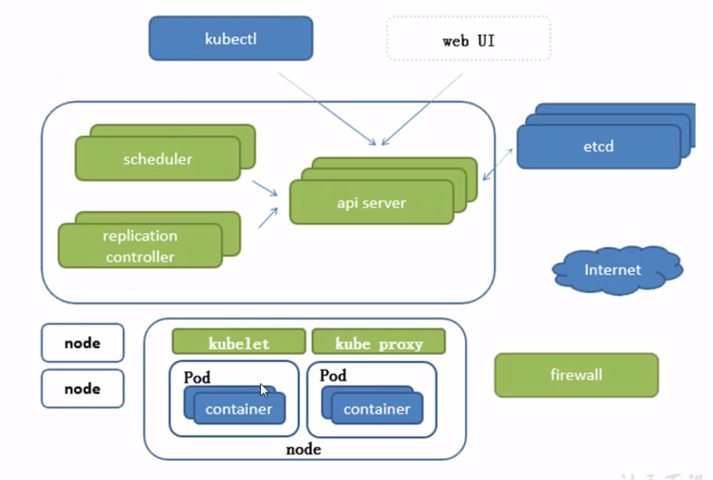

------

[TOC]

------

# 架构

## 架构图

## 主要组件

### APISERVER

所有服务的统一访问入口

### Controller

控制pod,如副本数量

### Scheduler

负责介绍任务，选择合适的节点分配任务

### ETCD

分布式键值对数据库，存储K8s集群所有重要信息

### KubeLet

直接跟容器引擎交互，实现Pod的生命周期管理

### Kube-Proxy

负责写入规则至iptables\ipvs，实现服务映射访问。

## 其他插件

### CoreDNS

为集群中的SVC创建一个域名IP的对应关系解析

### Dashboard

为K8s集群提个一个B/S结构的WEB UI

### IngressController

官方只实现了四层代理，Ingress实现了七层代理

### Federation

提供一个跨集群中心多K8s的统一管理功能

### Prometheus

提供K8s集群的监控能力

### Elk

提供K8s集群日志统一分析接入平台

