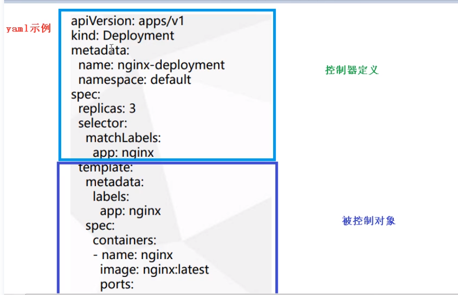
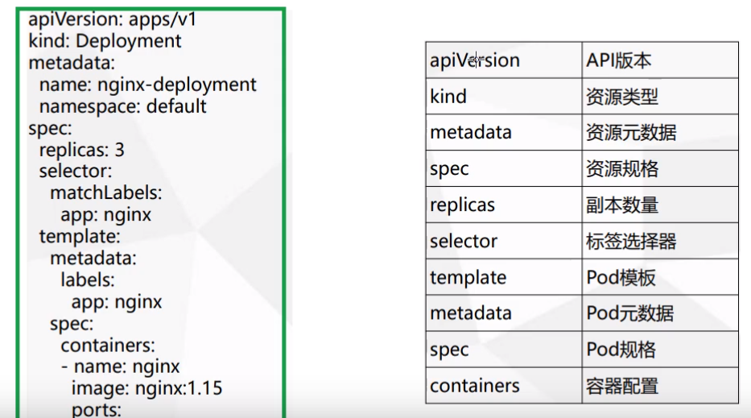

------

[TOC]

------

# 资源清单

## 大体结构

分为 控制器、控制对象



## 基本字段



### apiVersion——API版本

 通过命令 ` kubectl api-versions` 可以查看所有版本

### kind——资源类型

通过命令 ` kubectl api-resources` 可以查看所有资源类型

## 生成yaml

### 方式 1：干运行

```shell
kubectl create deployment web --image=ngnix -o=yaml --dry-run=client >my1.yaml
```

### 方式2：从资源创建

```shell
kubectl get deployments web -o=yaml 
```


