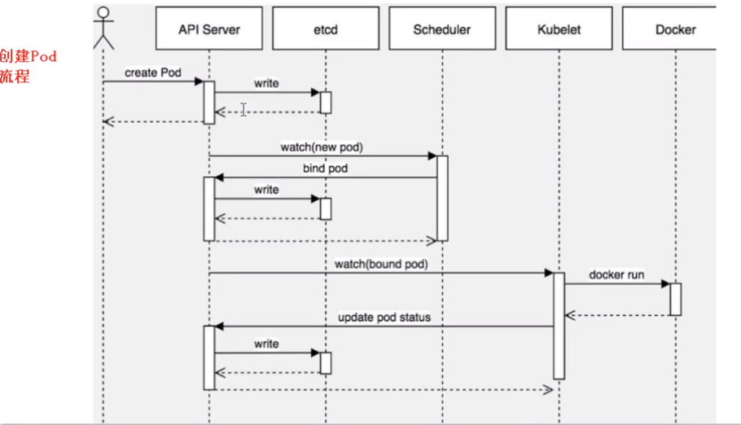

------

[TOC]

------

# 调度

pod的调度

## Pod的创建流程

泳道图



## 影响调度的Pod因素

Pod调度时，Pod自身属性影响调度策略

### 资源限定——resource.request

```yaml
#spec.containers.env.resource
resource:
  requsets:
    memory: "64Mi"
    cpu: "250m"
```

Pod不会调度到不符合request的Node上

### 节点选择器——nodeSelector

```yaml
spec:
  nodeSelector:
    env_role: dev
  containers:
```

节点选择器靠节点***label***进行选择

#### 节点Label

给节点打标签

```shell
kubectl label node node_name env_role=dev
```

获取节点所有标签

```shell
kubectl get node node_name --show-labels
```

### 节点亲和性——affinity.nodeAffinity

```yaml
spec:
  affinity:
    nodeAffinity:
```

节点亲和性同样靠节点***label***进行选择

#### 硬亲和性——requireDuringSchedulingIgnoreExecution

```yaml
spec:
  affinity:
    nodeAffinity:
      requireDuringSchedulingIgnoreExecution:
        nodeSelectorTerms: 
        - matchExpressions:
          - key: env_role
            operator: In
            values:
            - dev
            - test
```

当前约束条件**必须满足**

#### 软亲和性——preferredDuringSchedulingIgnoreExecution

```yaml
spec:
  affinity:
    nodeAffinity:
      preferredDuringSchedulingIgnoreExecution:
      - weignt: 1
        preference:
          matchExpressions:
          - key: env_role
            operator: In
            values:
            - dev
            - test
```

当前约束条件**尝试满足**

##### 亲和性操作

- In
- NotIn
- Exists
- DoesNotExists
- Gt
- Lt

## 影响调度的节点因素

Pod调度时，由于节点的属性导致影响调度策略

### 污点和污点容忍——Taint

设置节点的taint，节点不再参与普通的分配调度。如设置专用节点。

### 查看节点污点情况

```shell
kubectl describe node [node_name] | grep Taints
```

给节点打污点

```shell
kubectl taint node [node_name] [key]=[value]:NoSchedle
```

