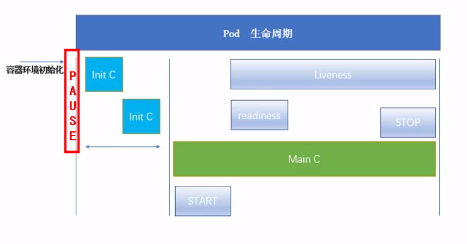

------

[TOC]

------

# Pod

## 概念

- 最小部署单元
- 包含多个容器
- 共享网络(单Pod内的多个容器)
- 共享存储(单Pod内的多个容器)
- pod生命周期短暂

## 价值

- docker本身单进程，一个容器一个进程，单容器运行一个应用
- pod突破了容器之间的网络、存储隔离，实现亲密性应用

## 分类

自主式Pod、被控制器管理的Pod

## Pod的生命周期

### Pod启动流程



### initC

init container,先于应用容器启动的容器，比应用容器多两个特点：

- InitC必须运行到成功为止，否则一直重启（配置重启策略下）
- 多个InitC必须按次序，串行启动

### Pod状态

pending , running, succeeded, failed, unknown

- 挂起（Pending）：

  Pod 已被 Kubernetes 系统接受，容器尚未创建完成。等待时间包括调度 Pod 的时间和通过网络下载镜像的时间

- 运行中（Running）：

  该 Pod 已经绑定到了一个节点上，Pod 中所有的容器都已被创建。至少有一个容器正在运行
  
- 成功（Succeeded）：

  Pod 中的所有容器都以成功状态终止，并不再启动。

- 失败（Failed）：

  Pod 中的有至少有一个容器是因为失败终止。也就是说，容器以非0状态退出或者被系统终止。
  
- 未知（Unknown）：
  
  因为某些原因无法取得 Pod 的状态，通常是因为与 Pod 所在主机通信失败


## Pod内容器的镜像拉取策略

```yaml
spec:
  containers:
  - name:
    image:
    imagePullPolicy: Always
```

- IfNotPresent :默认，不存在就拉取，存在直接用
- Always: 必拉
- Never：必不拉

## Pod中容器资源限制

```yaml
spec:
  containers:
  - name:
    image:
    env:
    - name:
      value:
      resource:
        requsets:
          memory: "64Mi"
          cpu: "250m"
        limit: 
          memory: "128Mi"
          cpu: "500m"
```

## Pod中容器重启策略

Pod内有容器异常时，要对容器重启，**注意：此策略针对该Pod内的所有容器，而非单个容器**

```yaml
spec:
  containers:
  restartPolicy: Never
```

- Always:容器退出后总是重启
- OnFailure:当容器异常退出时重启，即错误码非0时
- Never：从不重启

## Pod 内容器的健康检查

```yaml
spec:
  containers:
  - name:
    image:
    args:
     livenessProbe:
      exec:
        command:
        initialDeaaySeconds: 5
        periodSeconds: 5
```


### 必要性

Pod即便是Running状态，内部不一定正常提供服务，如java堆内存溢出时，故需要应用层的健康检查。

### 存活检查——livenessProbe

失败后，杀死Pod，根据重启策略决定重启.

如果容器不提供存活探针，则默认状态为Success

### 就绪检查——readinessProbe

如果就绪探测失败，**端点控制器**将从与Pod匹配的所有的**service的端点**中删除该Pod的IP地址，初始延迟之前的就绪状态默认为Failure。如果容器不提供就绪探针，则默认状态为Success

### 三种探针

1. httpGet

   http状态码[200，400)即成功

2. exec

   shell命令码为0为成功

3. tcpSocket

   sock建立成功
