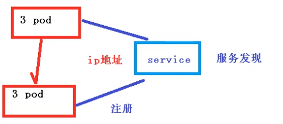
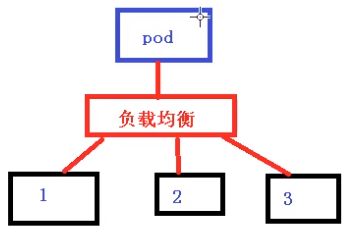

------

[TOC]

------

# Service

Pod与Controller之间通过label和selector建立联系

## 价值

### 1. 服务发现

防止Pod失联，将Pod的IP注册到Service，可通过Service访问Pod



### 2. 负载均衡

定义一组Pod的访问策略，实现负载均衡



## yaml文件

```shell
kubectl expose deployment web --port=80 --target-port=80 [--type=ClusterIP] --dry-run=client -o=yaml >service.yaml
```

```yaml
apiVersion: v1
kind: Service
metadata:
  creationTimestamp: null
  labels:
    app: web
  name: web
spec:
  ports:
  - port: 80
    protocol: TCP
    targetPort: 80
  selector:
    app: web
   #type: ClusterIP
status:
  loadBalancer: {}
```

## 类型——ClusterIP,NodePort,loadBalancer

### ClusterIP——集群IP

(默认)用于集群内部

spec.type:ClusterIP

### NodePort

用于对外访问应用

spec.type:NodePort

### loadBalancer

用于对外访问应用，集成了公有云的SDK


